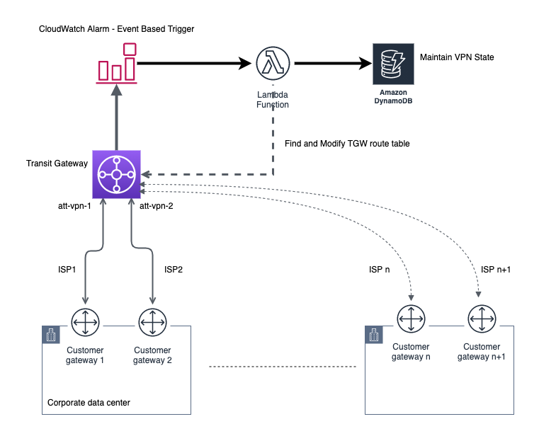
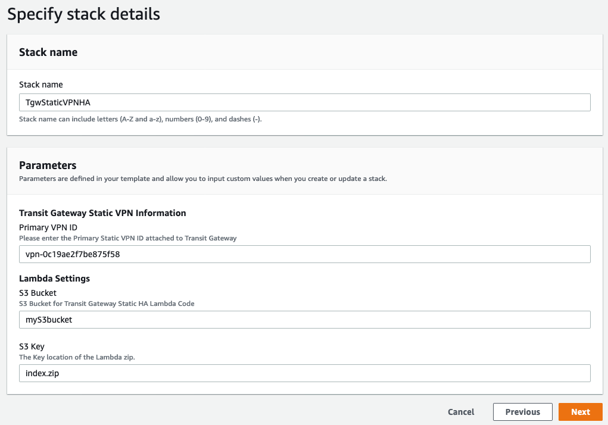
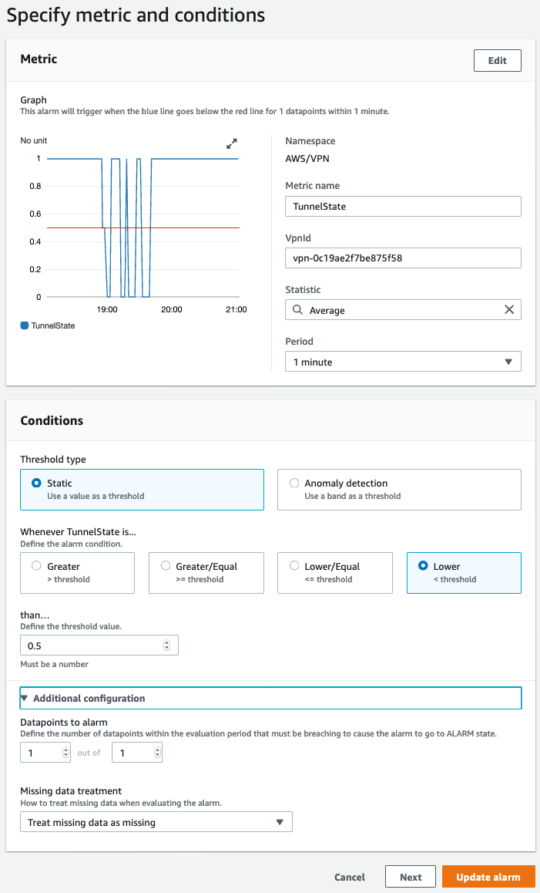
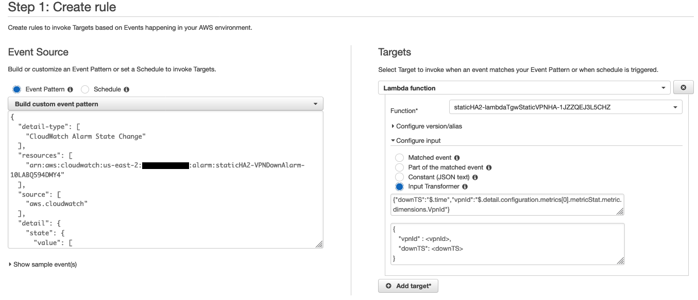

## Solution Overview:

AWS Transit Gateway doesn’t natively provide HA (high availability) for Static VPNs. There’s no automatic route propagation for Static VPNs prefixes and hence customers have to manually add static routes. In the event of VPN failure, this can result in significant downtime. This solution provides a way to automatically failover Static VPNs on AWS Transit Gateway using AWS Lambda function.


## Implementation Details:

The solution will use the following architecture:



* Transit Gateway Static VPN failure (Primary) will trigger CloudWatch Alarm
* CloudWatch Alarm trigger will be captured by Amazon EventBridge rule which will generate an event for Lambda Function
* Lambda Function will now query DynamoDB table
    * DynamoDB table maintains last VPN state change - This is to avoid false positive and not have continuous route switching. 
    * Lambda Function will take an action depending on VPN State TimeStamp:
        * If VPN flap was recent (< 5 minutes) - Do nothing
        * If this is new flap - Make a Replace Route call on TGW route table(s)
* If this is new flap event:
    * Lambda Function will find the backup VPN for the Primary VPN which triggered the alarm. This is done by querying tags added to the VPN connection. 
        * Example: 
            * Primary VPN will have tag  `Key:<vpnName> Value: primary `
            * Backup will have corresponding tag  `Key:<vpnName> Value: backup`

    * Lambda Function will check backup VPN status. Function will only proceed if there is atleast one active Tunnel on Backup VPN.
    * Lambda Function will query all the TGW route tables and find routes that have next hop attachment as primary VPN
    * Once all the TGW route tables and routes are found, Lambda Function replace it with backup VPN attachment


## Deployment Steps

Download the latest template (or clone the repo): [CF template](https://github.com/aws-samples/aws-transit-gateway-static-vpn-ha/raw/master/transit-gateway-static-vpn.yaml) 

### CF stack will create the following resources:

* DynamoDB table
* CloudWatch Alarm for Primary VPN
* AWS Lambda Function and required IAM policy
* AWS CloudWatch Event Rule




Once you deploy the Cloudformation stack, please ensure that you add correct tags to the VPN connection. Lamdba Function is looking for **Value** Tag from the corresponding **Key** . If you have vpn-abc123 as primary and vpn-xyz456 as backup. You’ll add the tags in the following way:

vpn-abc123
`Key:vpn1 Value: primary`

 vpn-xyz456
`Key:vpn1 Value: backup`

vpn1 is used as an example here. Key can be anything but should be same for pair of primary/backup VPN connections.


### Scale for more than one Static VPN:

This solution can scale for more than one pair of Static VPNs. Customers can add tags to any additional pair of VPN connections and setup CloudWatch Alarm + Amazon EventBridge rule.

* Since Lambda Function is querying tags to find backup VPN, ensure that you add unique  `Key:<vpnName>` for each additional pair of VPNs
    * Example. Second Pair of VPN can have the following Tags:
        * Primary VPN will have tag  `Key:vpn2 Value: primary `
        * Backup will have corresponding tag   `Key:vpn2 Value: backup`


After you add the tags, go ahead and manually create CloudWatch Alarm and CloudWatch Event rule for **primary VPN connection** only.

**Step 1:** Create CloudWatch Alarm with the following configuration:



**Step 2:** Create CloudWatch Event rule with the following configurations:


### **Event Source**

**Event Pattern** - Use Build custom event pattern with the following pattern

```
  {
      "detail-type": [
        "CloudWatch Alarm State Change"
      ],
      "resources": [
        "<CloudWatch Alarm ARN>"
      ],
      "source": [
        "aws.cloudwatch"
      ],
      "detail": {
        "state": {
          "value": [
            "ALARM"
          ]
        }
      }
    }
```


**Targets**

* From the drop down select the Lambda Function launched by CloudFormation Template
* Configure version/alias - Keep Default
* Configure input -  Select Input Transformer with the following configuration:

Under Input Path:

```
{"downTS":"$.time","vpnId":"$.detail.configuration.metrics[0].metricStat.metric.dimensions.VpnId"}
```


Under Template:

```
{
   "vpnId" : <vpnId>,
   "downTS": <downTS>
}
```


Your rule should look like this:



## Limitations

* There’s no preempt i.e. if VPN fail-overs from primary to backup and if your primary comes back online - The function will not replace routes with Primary VPN attachment, you’ll have to manually update the Transit Gateway Route table.
* You can only have pair of VPNs in primary, backup configuration. 
* Cloudformation is provided for one pair of static VPNs. For additional VPNs, you’ll will have to manually add CloudWatch Alarm and CloudWatch Event rule
* Solution will not work with Prefix list references with Attachment ID as Static VPN connection

# License

This sample code is made available under the MIT-0 license. See the LICENSE file.
